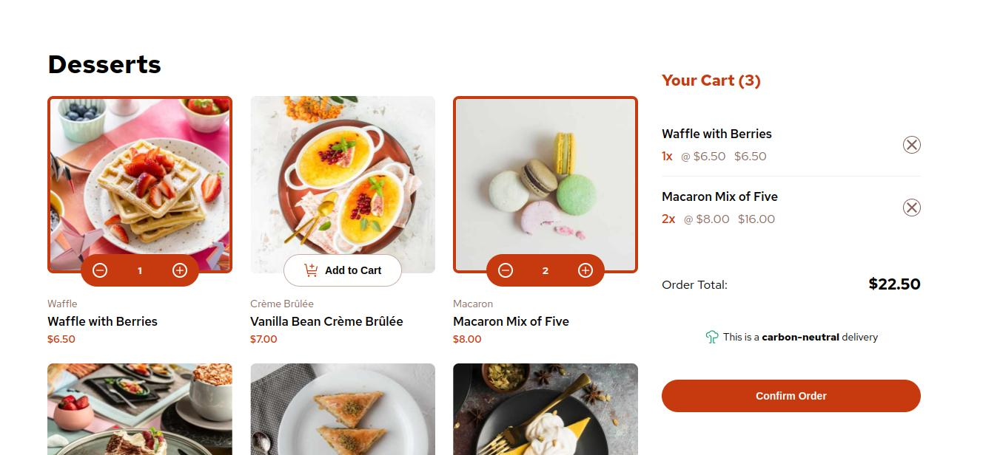

# Frontend Mentor - Product list with cart solution

This is a solution to the [Product list with cart challenge on Frontend Mentor](https://www.frontendmentor.io/challenges/product-list-with-cart-5MmqLVAp_d). Frontend Mentor challenges help you improve your coding skills by building realistic projects. 

## Table of contents

- [Overview](#overview)
  - [The challenge](#the-challenge)
  - [Screenshot](#screenshot)
  - [Links](#links)
- [My process](#my-process)
  - [Built with](#built-with)
  - [What I learned](#what-i-learned)
  - [Useful resources](#useful-resources)
- [Author](#author)

## Overview

### The challenge

Users should be able to:

- Add items to the cart and remove them
- Increase/decrease the number of items in the cart
- See an order confirmation modal when they click "Confirm Order"
- Reset their selections when they click "Start New Order"
- View the optimal layout for the interface depending on their device's screen size
- See hover and focus states for all interactive elements on the page

### Screenshot

### Links

- Solution URL: https://www.frontendmentor.io/solutions/product-list-with-cart-using-a-json-data-file-qOjmhjKoE4
- Live Site URL: https://xxosielxx.github.io/product-list-with-cart-challenge

## My process

### Built with

- Semantic HTML5 markup
- CSS custom properties
- Flexbox
- CSS Grid
- Mobile-first workflow

### What I learned

- How to implement a cart system with add, remove, and quantity update functionality
- How to use a JSON data file in development

### Useful resources

- [Blackbox AI](https://www.blackbox.ai/) - Blackbox AI is an AI-powered coding assistant designed to help developers tackle coding challenges efficiently. It's primary features include: code generation, real-time suggestions, image-to-text analysis and community library access. Blackbox AI integrates seamlessly with Visual Studio Code, making coding faster and easier.
- [Stackoverflow](https://stackoverflow.com/) - This is an excelent way to search for solutions. In this popular website I found solutions to my code problems many times because I am never the first to have a specific problem appear.

## Author

- [Website ](https://xxosielxx.github.io/osez-folio)
- [LinkedIn](https://www.linkedin.com/in/osiel-hern%C3%A1ndez-rodr%C3%ADguez-9869612a1/)
- [Github](https://github.com/xXOsielXx)
- [Stackoverflow Español](https://es.stackoverflow.com/)
- [Frontend Mentor](https://www.frontendmentor.io/profile/xXOsielXx)